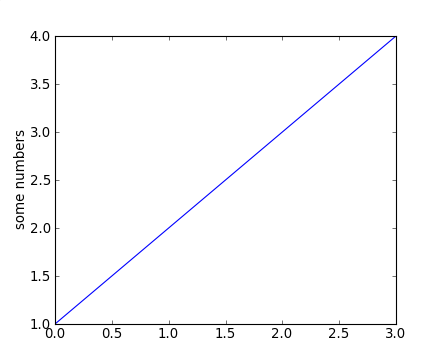
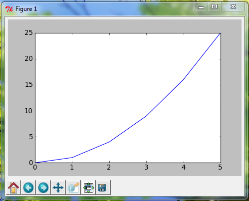
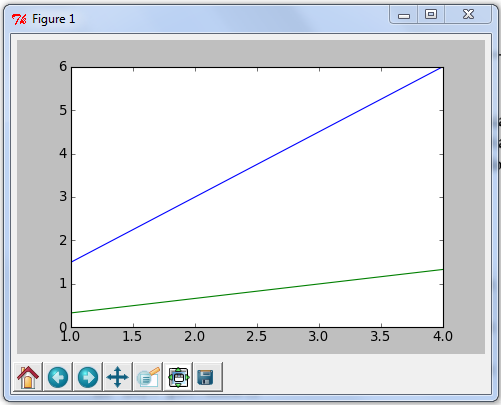
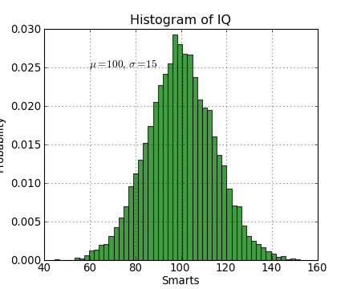
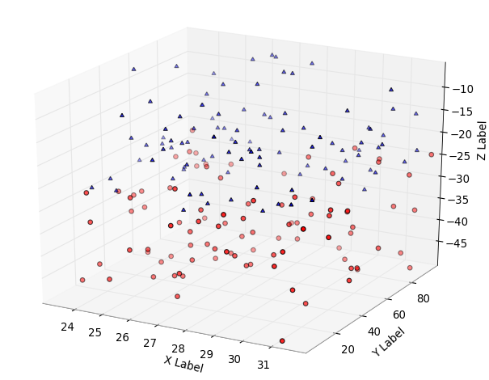

Matplotlib
==========

::

    >>> import matplotlib.pyplot as plt

http://matplotlib.sourceforge.net/users/pyplot_tutorial.html

=============================================
Графики
=============================================

::

    import matplotlib.pyplot as plt
    plt.plot([1,2,3,4])
    plt.ylabel('some numbers')
    plt.show()

Построить график x от y, используя стиль и цвет линии по умолчанию: ``plot(x, y)``

Построить график x от y синего цвета и круглыми маркерами: ``plot(x, y, 'bo')``

Построить график y считая, что x - массив 0..N-1: ``plot(y)``

Тоже самое, но красными крестиками: ``plot(y, 'r+')``

‘b’ blue
‘g’ green
‘r’ red
‘c’ cyan
‘m’ magenta
‘y’ yellow
‘k’ black
‘w’ white

'-' solid line style
'--' dashed line style
'-.' dash-dot line style
':' dotted line style
'.' point marker
',' pixel marker
'o' circle marker
'v' triangle_down marker
'^' triangle_up marker
'<' triangle_left marker
'>' triangle_right marker
'1' tri_down marker
'2' tri_up marker
'3' tri_left marker
'4' tri_right marker
's' square marker
'p' pentagon marker
'*' star marker
'h' hexagon1 marker
'H' hexagon2 marker
'+' plus marker
'x' x marker
'D' diamond marker
'd' thin_diamond marker
'|' vline marker
'_' hline marker

::

    >>> x = range(6)
    >>> plt.plot(x, [xi**2 for xi in x])
    [<matplotlib.lines.Line2D object at 0x03D2C830>]
    >>> plt.show()

Несколько графиков: вызвать несколько раз ``plot()`` до вызова ``show()``. ::

    >>> x = range(1, 5)
    >>> plt.plot(x, [xi*1.5 for xi in x])
    [<matplotlib.lines.Line2D object at 0x03EF9830>]
    >>> plt.plot(x, [xi/3.0 for xi in x])
    [<matplotlib.lines.Line2D object at 0x03EF9350>]
    >>> plt.show()

::

    import matplotlib.pyplot as plt
    plt.figure(1)           # the first figure
    plt.subplot(211)        # the first subplot
                            # in the first figure
    plt.plot([1,2,3])
    plt.subplot(212)        # the second subplot
                            # in the first figure
    plt.plot([4,5,6])

    plt.figure(2)           # a second figure
    plt.plot([4,5,6])       # creates a subplot(111)
                            # by default

    plt.figure(1)           # figure 1 current;
                            # subplot(212) still current
    plt.subplot(211)        # make subplot(211)
                            # in figure1 current
    plt.title('Easy as 1,2,3')  # subplot 211 title

=============================================
Текст
=============================================

http://matplotlib.sourceforge.net/users/text_intro.html#text-intro

::

    import numpy as np
    import matplotlib.pyplot as plt

    mu, sigma = 100, 15
    x = mu + sigma * np.random.randn(10000)

    # the histogram of the data
    n, bins, patches = plt.hist(x, 50, normed=1, facecolor='g', alpha=0.75)

    plt.xlabel('Smarts')
    plt.ylabel('Probability')
    plt.title('Histogram of IQ')
    plt.text(60, .025, r'$\mu=100,\ \sigma=15$')
    plt.axis([40, 160, 0, 0.03])
    plt.grid(True)

=============================================
3D
=============================================

::

    import matplotlib.pyplot as plt
    from mpl_toolkits.mplot3d import axes3d, Axes3D
    import numpy

    fig = plt.figure()
    ax = Axes3D(fig)
    n = 100
    for c, m, zl, zh in [('r', 'o', -50, -25),
            ('b', '^', -30, -5)]:
        xs = randrange(n, 23, 32)
        ys = randrange(n, 0, 100)
        zs = randrange(n, zl, zh)
        ax.scatter(xs, ys, zs, c=c, marker=m)

    ax.set_xlabel('X Label')
    ax.set_ylabel('Y Label')
    ax.set_zlabel('Z Label')

    plt.grid(True)
    plt.show()

::

    >>> import numpy
    >>> data = numpy.array([1, 2, 3, 4, 5])
    >>> data
    array([1, 2, 3, 4, 5])
    >>> numpy.average(data)
    3.0
    >>> data = data - numpy.average(data)
    >>> data
    array([-2., -1.,  0.,  1.,  2.])
    >>> big = float(max(data))
    >>> sml = float(min(data))
    >>> data = data/abs(big - sml)
    >>> data
    array([-0.5 , -0.25,  0.  ,  0.25,  0.5 ])

    import matplotlib.pyplot as plt
    plt.legend(loc='lower center')
      'best'         : 0,
      'upper right'  : 1,  (default)
      'upper left'   : 2,
      'lower left'   : 3,
      'lower right'  : 4,
      'right'        : 5,
      'center left'  : 6,
      'center right' : 7,
      'lower center' : 8,
      'upper center' : 9,
      'center'       : 10
