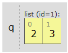
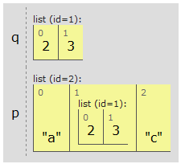
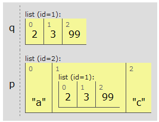
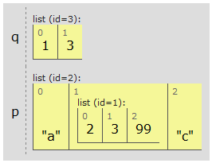

Python
======

* интерпретируемый язык
* группирование инструкций выполняется с помощью отступов вместо фигурных скобок
* нет необходимости в объявлении переменных
* динамическая типизация
* все данные, которые обрабатываются сценариями, являются объектами

::

    >>> import this
    The Zen of Python, by Tim Peters

    Beautiful is better than ugly.
    Explicit is better than implicit.
    Simple is better than complex.
    Complex is better than complicated.
    Flat is better than nested.
    Sparse is better than dense.
    Readability counts.
    Special cases aren't special enough to break the rules.
    Although practicality beats purity.
    Errors should never pass silently.
    Unless explicitly silenced.
    In the face of ambiguity, refuse the temptation to guess.
    There should be one-- and preferably only one --obvious way to do it.
    Although that way may not be obvious at first unless you're Dutch.
    Now is better than never.
    Although never is often better than *right* now.
    If the implementation is hard to explain, it's a bad idea.
    If the implementation is easy to explain, it may be a good idea.
    Namespaces are one honking great idea -- let's do more of those!

=============================================
Типы
=============================================

*– динамическая типизация*

::

    >>> type(4)
    <type 'int'>

    >>> type(5.0)
    <type 'float'>

    >>> type(4L)
    <type 'long'>

    >>> type(True)
    <type 'bool'>

    >>> type("a")
    <type 'str'>

    >>> def f():
        print "Hello"
    >>> type(f)
    <type 'function'>

    >>> type(2j + 6j + 4)
    <type 'complex'>

    >>> type(u"Hello")
    <type 'unicode'>

    >>> type({})
    <type 'dict'>

    >>> type([])
    <type 'list'>

    >>> type(())
    <type 'tuple'>

    >>> type(None)
    <type 'NoneType'>

=============================================
помощь (help, dir)
=============================================

``dir(S)`` возвращает список всех доступных атрибутов объекта ::

    >>> import re
    >>> dir(re)
    ['DEBUG', 'DOTALL', 'I', 'IGNORECASE', ...]
    >>> dir([])
    ['__add__', '__class__', '__contains__', ...]

    >>> def f(x):
        print x
    >>> dir(f)
    ['__call__', '__class__', '__closure__', '__code__', '__defaults__', '__delattr__', '__dict__', '__doc__', '__format__', '__get__', '__getattribute__', '__globals__', '__hash__', '__init__', '__module__', '__name__', '__new__', '__reduce__', '__reduce_ex__', '__repr__', '__setattr__', '__sizeof__', '__str__', '__subclasshook__', 'func_closure', 'func_code', 'func_defaults', 'func_dict', 'func_doc', 'func_globals', 'func_name']
    --------------------------------------------
    >>> def f(g):
            x = g
            dir()
            print g, dir()
    >>> f(3)
    3 ['g', 'x']

`help("dir")`` запрашивает информацию об объекте (документацию)

=============================================
print, repr, str
=============================================

Автоматический вывод (в форме как есть): ::

    >>> n = 1 / 3.0
    >>> n
    0.33333333333333331
    >>> repr(n)
    '0.33333333333333331'

Преобразование значения в более дружественно представление (используется функцией print): ::

    >>> str(n)
    '0.333333333333'
    >>> print(n)
    0.333333333333

=============================================
Числа
=============================================

::

    >>> (30 - 15)/.2
    75.0

**Комплексные числа:** мнимая часть записывается с суффиксом ``'j'`` или ``'J'`` (или ``complex(real, imag)``). ::

    >>> (2j + 6j + 4)/2
    (2+4j)
    >>> complex(2, 4) - 3j
    (2+1j)
    >>> a=1.5+0.5j
    >>> a.real
    1.5
    >>> a.imag
    0.5

Восьмеричные литералы начинаются с 0 ::

    >>> 021
    17
    >>> oct(17)
    '021'

Шестнадцатеричные литералы начинаются с ``0x`` или ``0X`` ::

    >>> 0x1A
    26
    >>> hex(26)
    '0x1a'
    Бинарные литералы:
    >>> bin(7)
    '0b111'

Функции преобразования: ``int()``, ``long()``, ``float()``... ::

    >>> a = 9.7
    >>> int(a)
    9

Округление: ::

    >>> print round(2.675, 2)
    2.68

Возведение в степень: ::

    >>> 2 ** 4
    16
    >>> pow(2, 4)
    16

Абсолютное значение: ::

    >>> abs(-12)
    12

Модуль **math**: ::

    >>> import math
    >>> math.pi, math.e
    (3.1415926535897931, 2.7182818284590451)
    >>> math.sqrt(144)
    12.0

=============================================
Строки
=============================================

*– неизменяемые последовательности (нельзя присвоить значение отдельной позиции)*

Строки в апострофах и кавычках – это одно и то же: ::

    >>> "doesn't"
    "doesn't"
    >>> 'doesn\'t'
    "doesn't"

    >>> S = "Spam"
    >>> len(S)  # длина
    4
    >>> S[0]    # первый элемент с начала
    'S'
    >>> S[-1]   # последний (элемент первый с конца)
    'm'
    >>> S[1:3]  # срез строки (от 1 до 2)
    'pa'
    >>> S[:-2]  # все кроме последних двух
    'Sp'
    >>> S[:]    # копия строки
    'Spam'
    >>> S * 3   # повторение
    'SpamSpamSpam'
    >>> "Hello" + 3
    TypeError: cannot concatenate 'str' and 'int' objects

Вхождение подстроки в строку: ::

    >>> "th" in "python"
    True

Шаг по индексу: ::

    >>> X = "123123123123"
    >>> X[2:8:2]     # "123123123123"
    '321'

Каждый третий элемент: ::

    >>> X[::3]       # "123123123123"
    '1111'

В обратном порядке: ::

    >>> X = "mathematics"
    >>> X[::-1]
    'scitamehtam'
    >>> X[::-3]      # "mathematics"
    'stea'
    >>> X[3:7:-1]    # "mathematics"
    ''
    >>> X[7:3:-1]    # "mathematics"
    'tame'

Получить любой символ строки можно по индексу. ::

     +---+---+---+---+---+
     | H | e | l | p | A |
     +---+---+---+---+---+
     0   1   2   3   4   5
    -5  -4  -3  -2  -1

Поиск: ::

    >>> S.find('pa') # смещение подстроки
    1
    >>> S.find('k')  # -1 при неудаче
    -1

Замена подстроки другой: ::

    >>> "aa$bb$cc".replace('$', 'SPAM')
    'aaSPAMbbSPAMcc'
    >>> "aa$bb$cc".replace('$', 'SPAM', 1)
    'aaSPAMbb$cc'

Разбить по разделителю: ::

    >>> 'aa,bbb,cc, d'.split(',')
    ['aa', 'bbb', 'cc', ' d']

    >>> import re
    >>> re.split('[ ,?]', "Hey, what's your name?")
    ['Hey', "what's", 'your', 'name', '']

Получить код ASCII: ::

    >>> ord('\n')
    10
    >>> chr(10)
    '\n'

Устроенные кавычки: ``'''`` или ``"""`` ::

    >>> """ doesn't """
    " doesn't "
    >>> ''' doesn't '''
    " doesn't "

Удаление пробелов и знаков конца строки: ::

    >>> '    This is a string    '.strip()
    'This is a string'
    >>> '  \n  This is a string \n   '.strip()
    'This is a string'
    >>> '    This is a string    '.rstrip()
    '    This is a string'
    >>> '    This is a string\n'.rstrip('\n')
    '    This is a string'

Форматирование строки: ``%[(name)][flags][width][.precision]code`` ::

    >>> 'That is %d %s bird!' % (1, 'dead')
    'That is 1 dead bird!'

Для любого объекта может быть указан спецификатор %s.
Выражение форматирования не изменяет строку, а создает новую. ::

    >>> d = 'That is %d %s bird!'
    >>> s = d % (1, 'dead')
    >>> s
    'That is 1 dead bird!'
    >>> d
    'That is %d %s bird!'

Получение строки из списка: ::

    >>> " + ".join(['a', 'b', 'c'])
    'a + b + c'

=============================================
Списки
=============================================

*- могут содержать объекты произвольных типов*
*- размер неограничен*
*- изменяемые*

::

    >>> L = [123, 'spam', 1.23]
    >>> L.sort()
    >>> L
    [1.23, 123, 'spam']
    >>> [1, 2, 3] * 3
    [1, 2, 3, 1, 2, 3, 1, 2, 3]
    >>> [123] + ['abc'] + []        # конкатенация
    [123, 'abc']

-----------------------------------
Добавить элемент в конец списка
-----------------------------------
::

    >>> L = [1, 2]
    >>> L.append('3')
    >>> L
    [1, 2, '3']

Добавить несколько элементов: ::

    >>> L = [1, 2]
    >>> L.extend([3, 4])
    >>> L
    [1, 2, 3, 4]

Добавление элемента под указанным индексом: ``insert(index, object)`` ::

    >>> L = [1, 'b', 7, -3, 'a']
    >>> L.insert(2, 'c')
    >>> L
    [1, 'b', 'c', 7, -3, 'a']

Найти индекс первого элемента с указанным значением: ::

    >>> L = [1, 'b', 7, -3, 'a']
    >>> L.index(7)
    2

Вложенные списки: ::

    >>> q = [2, 3]

::

    >>> p = ['a', q, 'c']

::

    >>> p
    ['a', [2, 3], 'c']
    >>> q.append(99)

::

    >>> p
    ['a', [2, 3, 99], 'c']
    >>> q = 2

Удалить первый элемент, имеющий указанное значение: ::

    >>> L = [1, 'a', 7, -3, 'a']
    >>> L.remove('a')
    >>> L
    [1, 7, -3, 'a']

--------------------------------------
Извлечь элемент списка по индексу:
--------------------------------------
::

    >>> L = [1, 'b', 7, -3, 'a']
    >>> L.pop(0)
    1
    >>> L
    ['b', 7, -3, 'a']
    >>> L.pop(-1)
    'a'
    >>> L
    ['b', 7, -3]

Подсчитать количество элементов, имеющих заданное значение: ::

    >>> L = [1, 'a', 7, -3, 'a']
    >>> L.count('a')
    2

Удалить элемент: ::

    >>> L = [1, 'b', 7, -3, 'a']
    >>> del L[1]
    >>> L
    [1, 7, -3, 'a']

Сортировать по возрастанию и по убыванию: ::

    >>> L = [1, 'a', 7, -3, 'a']
    >>> L.sort()
    >>> L
    [-3, 1, 7, 'a', 'a']
    >>> L.sort(reverse = True)
    >>> L
    ['a', 'a', 7, 1, -3]

--------------------------------------
Перевернуть (обратить) список:
--------------------------------------
::

    >>> L = [1, 'a', 7, -3, 'a']
    >>> L.reverse()
    >>> L
    ['a', -3, 7, 'a', 1]

--------------------------------------
Пересечение двух списков:
--------------------------------------
::

    >>> b1 = [11, 2, 6, -1, 5, 9, 11, 15]
    >>> b2 = [11, 'q', -1, 8, 11]
    >>> b3 = [val for val in b1 if val in b2]
    >>> b3
    [11, -1, 11]

--------------------------------------
Уникальные значения из списка:
--------------------------------------
::

    >>> testdata = [['a', 1], [1, 'a'], ['a', 1], ['a', 1, 2]]
    >>> unique_data = [list(x) for x in set(tuple(x) for x in testdata)]
    >>> unique_data
    [['a', 1], ['a', 1, 2], [1, 'a']]

``range`` vs. ``xrange``: ::

    >>> x = range(0, 5)
    >>> x
    [0, 1, 2, 3, 4]
    >>> type(x)
    <type 'list'>

    >>> x = xrange(0, 5)
    >>> x
    xrange(5)
    >>> type(x)
    <type 'xrange'>

    >>> for i in xrange(0, 2):
        print i
        print type(i)
    0
    <type 'int'>
    1
    <type 'int'>

``range([start,] stop [, step])`` ::

    >>> range(10)
    [0, 1, 2, 3, 4, 5, 6, 7, 8, 9]
    >>> range(5,10)
    [5, 6, 7, 8, 9]
    >>> range(0,10,2)
    [0, 2, 4, 6, 8]

--------------------------------------
Обход последовательностей параллельно:
--------------------------------------
::

    >>> L = [1, 2, 3, 4, 5, 6]
    >>> T = [11, 22, 33, 44]
    >>> zip(L, T)
    [(1, 11), (2, 22), (3, 33), (4, 44)]
    >>> for (x, y) in zip(L, T):
        print y - x
    10
    20
    30
    40

--------------------------------------
Сортировать параллельно несколько списков:
--------------------------------------
::

    >>> a = ['1', '4', '2', '6', '3']
    >>> b = ['r', 'a', 'e', 'k', 'b']
    >>> c = [ 5,   7,   3,   1,   2]
    >>> zipped = sorted(zip(a, b, c))
    >>> zipped
    [('1', 'r', 5), ('2', 'e', 3), ('3', 'b', 2), ('4', 'a', 7), ('6', 'k', 1)]
    >>> a = [a1 for (a1, b1, c1) in zipped]
    >>> a
    ['1', '2', '3', '4', '6']
    >>> b = [b1 for (a1, b1, c1) in zipped]
    >>> b
    ['r', 'e', 'b', 'a', 'k']
    >>> c = [c1 for (a1, b1, c1) in zipped]
    >>> c
    [5, 3, 2, 7, 1]

``enumerate`` ::

    >>> a = ["a", "b", "c", "d"]
    >>> for (i, item) in enumerate(a):
        print "index = %d, item = %s" % (i, item)
    index = 0, item = a
    index = 1, item = b
    index = 2, item = c
    index = 3, item = d

Функция ``enumerate`` возвращает объект-генератор (разновидность объекта, который поддерживает итерационный протокол)

Генератор списков: ::

    >>> [a+1 for a in x]
    [9, 8, 7, 4, 3, 2, 1, 0]
    >>> [(a+1, a-1) for a in x]
    [(9, 7), (8, 6), (7, 5), (4, 2), (3, 1),
    (2, 0), (1, -1), (0, -2)]
    >>> x = range(10)
    >>> [i+1 for i in x if i > 5]
    [7, 8, 9, 10]
    # все сочетания:
    >>> [x + y for x in 'abc' for y in '123']
    ['a1', 'a2', 'a3', 'b1', 'b2', 'b3', 'c1', 'c2', 'c3']

Генераторы списков работают почти в два раза быстрее ``for``, т.к. выполняются со скоростью языка C.

Конструирование словаря: ::

    >>> dict(zip(L, T))
    {1: 11, 2: 222, 3: 33, 4: 44}

--------------------------------------
Декартово произведение нескольких списков
--------------------------------------
::

    import itertools
    for i in itertools.product([1,2,3],['a','b'],[4,5]):
        print i
    (1, 'a', 4)
    (1, 'a', 5)
    (1, 'b', 4)
    (1, 'b', 5)
    (2, 'a', 4)
    (2, 'a', 5)
    (2, 'b', 4)
    (2, 'b', 5)
    (3, 'a', 4)
    (3, 'a', 5)
    (3, 'b', 4)
    (3, 'b', 5)

    >>> somelists = [ [1, 2, 3], ['a', 'b'], [4, 5] ]
    >>> for i in itertools.product(*somelists):
    >>>     print i

    >>> it = itertools.product([1,2,3],['a','b'],[4,5])
    >>> it
    <itertools.product object at 0x02F05C38>
    >>> mylist = list(it)
    >>> mylist
    [(1, 'a', 4), (1, 'a', 5), (1, 'b', 4), (1, 'b', 5), (2, 'a', 4), (2, 'a', 5), (2, 'b', 4), (2, 'b', 5), (3, 'a', 4), (3, 'a', 5), (3, 'b', 4), (3, 'b', 5)]
    >>> for item in mylist:
        print type(item)
    <type 'tuple'>
    ...

--------------------------------------
Удаление элементов из списка
--------------------------------------
::

    >>> a=range(10)
    >>> for item in a:
        if item<5:
            a.remove(item)
    >>> print a
    [1, 3, 5, 6, 7, 8, 9]

Почему так происходит? Потому что при удалении элемента из списка, индекс не уменьшается.
А значит, следующий элемент списка будет пропущен.
Нам на помощь приходит такая замечательная функция как ``filter(func, a)``.
Она создает новый список из элементов списка, для которым функция ``func(item)`` вернет истину. ::

    >>> a=range(10)
    >>> filter(lambda x:x>=5, a)
    [5, 6, 7, 8, 9]
    >>> a
    [0, 1, 2, 3, 4, 5, 6, 7, 8, 9]

или: ::

    >>> [i for i in a if i>=5]
    [5, 6, 7, 8, 9]
    >>> a
    [0, 1, 2, 3, 4, 5, 6, 7, 8, 9]

=============================================
random
=============================================

Случайное вещественное число от 0 до 1: ::

>>> random.random()
0.37444887175646646

Случайное вещественное число от 0 до 10: ::

    >>> random.uniform(1, 10)
    1.1800146073117523

Случайное целое число от 0 до 10 (включительно): ::

    >>> random.randint(1, 10)
    7

Случайное целое четное число от 0 до 100: ::

    >>> random.randrange(0, 101, 2)
    26

Выбирает случайный элемент из последовательности: ::

    >>> random.choice('abcdefghij')
    'c'

Перемешать случайным образом элементы списка: ::

    >>> items = [1, 2, 3, 4, 5, 6, 7]
    >>> random.shuffle(items)
    >>> items
    [7, 3, 2, 5, 6, 4, 1]

Выбрать случайным образом k элементов из списка: ::

    >>> random.sample([1, 2, 3, 4, 5],  3)
    [4, 1, 5]

=============================================
Словари
=============================================

*– отображения (доступ по ключам)*
*– изменяемые*

Способы создания словарей: ::

    >>> {'name': 'mel', 'age': 45}
    {'age': 45, 'name': 'mel'}

    >>> D = {}
    >>> D['name'] = 'mel'
    >>> D['age'] = 45

    >>> dict(name='mel', age=45)
    {'age': 45, 'name': 'mel'}

    >>> dict([('name', 'mel'), ('age', 45)])
    {'age': 45, 'name': 'mel'}

    >>> dict.fromkeys(['a', 'b', 'c'], 1)
    {'a': 1, 'c': 1, 'b': 1}

Определить наличие ключа: ::

    >>> D = {'a': 1, 'c': 3, 'b': 2}
    >>> D.has_key('f')
    False

Длина списка ключей: ::

    >>> D = {'a': 1, 'c': 3, 'b': 2}
    >>> len(D)
    3

Получить список всех ключей: ::

    >>> D = {'a': 1, 'c': 3, 'b': 2}
    >>> D.keys()        # неупорядоченный
    ['a', 'c', 'b']
    >>> sorted(D)       # упорядоченный
    ['a', 'b', 'c']
    >>> D
    {'a': 1, 'c': 3, 'b': 2}

Списки значений элементов словаря: ::

    >>> D = {'a': 1, 'c': 3, 'b': 2}
    >>> D.values()
    [1, 3, 2]
    >>> D.items()
    [('a', 1), ('c', 3), ('b', 2)]

Удаление элемента: ::

    >>> D = {'a': 1, 'c': 3, 'b': 2}
    >>> del D['c']
    >>> D
    {'a': 1, 'b': 2}

Удалить элемент из словаря (если возможно его там нет): ::

    >>> spam = {"one": 1, "two": 2}
    >>> spam.pop('egg')
    Traceback (most recent call last):
      File "<pyshell#11>", line 1, in <module>
        spam.pop('egg')
    KeyError: 'egg'
    >>> print spam.pop('egg', None)
    None

Получение элемента по ключу: ::

    >>> D = {'a': 1, 'c': 3, 'b': 2}
    >>> D.get('a')       # ключ присутствует
    1
    >>> print D.get('d') # ключ отсутствует
    None

«Конкатенация» словарей: ::

    >>> D = {'a': 1, 'c': 3, 'b': 2}
    >>> D1 = {'a': 11, 'e': 5}
    >>> D.update(D1)
    >>> D
    {'a': 11, 'c': 3, 'b': 2, 'e': 5}

Обход словаря: ::

    >>> for key in D:
        print key
    a    c    b    e

Ключами словаря могут быть только неизменяемые объекты: строки, числа, кортежи, экземпляры классов. ::

    >>> Matrix = {}
    >>> Matrix[(2, 3, 4)] = 88

=============================================
Кортежи
=============================================

*– неизменяемые*
::

    >>> T = (1, 2, 3, 4)
    >>> T[0]
    1

=============================================
Множества
=============================================

::

    >>> X = set('spam')
    >>> Y = set(['h', 'a', 'm'])
    >>> X, Y
    (set(['a', 'p', 's', 'm']), set(['a', 'h', 'm']))

Пересечение: ::

    >>> X & Y
    set(['a', 'm'])

Объединение: ::

    >>> X | Y
    set(['a', 'p', 's', 'h', 'm'])

Разность: ::

    >>> X - Y
    set(['p', 's'])

=============================================
Файлы
=============================================

Неформатированные строки подавляют экранирование. ::

    f = open('C:\\new\\data.txt', 'w')
    f = open(r'C:\new\data.txt', 'w')

Создать файл: ::

    >>> f = open('data.txt', 'w')
    >>> type(f)
    <type 'file'>
    >>> f
    <open file 'data.txt', mode 'w' at 0x02FA99C0>

Записать строку в файл: ::

    >>> f.write('Hello\n')

Закрыть файл (выталкивает выходные буферы на диск): ::

    >>> f.close()
    >>> f
    <closed file 'data.txt', mode 'w' at 0x02FA99C0>

Открыть файл ('r' – режим доступа по умолчанию): ::

    >>> f = open('data.txt')

Читать файл целиком в стоку: ::

    >>> s = f.read()
    >>> s
    'Hello\nWorld\n'
    >>> s.split()
    ['Hello', 'World']

Читать по одной стоке (включая символ конца строки): ::

    >>> f = open('data.txt')
    >>> f.readline()
    'Hello\n'

+--------------------------+---------------------------------------------------------------------------------------+
|``aString = f.read()``    |Чтение файла целиком в единственную строку                                             |
+--------------------------+---------------------------------------------------------------------------------------+
|``aString = f.read(N)``   |Чтение следующих N байтов (одного или более) в строку                                  |
+--------------------------+---------------------------------------------------------------------------------------+
|``aList = f.readlines()`` |Чтение файла целиком в список строк.                                                   |
+--------------------------+---------------------------------------------------------------------------------------+
|``f.write(aString)``      |Запись строки в файл                                                                   |
+--------------------------+---------------------------------------------------------------------------------------+
|``f.writelines(aList)``   |Запись всех строк из списка в файл                                                     |
+--------------------------+---------------------------------------------------------------------------------------+
|``f.seek(N)``             |Изменяет текущую позицию в файле для следующей операции, смещая ее на N байтов         |
|                          |от начала файла                                                                        |
+--------------------------+---------------------------------------------------------------------------------------+

Функция ``readlines()`` загружает файл целиком в список строк,
тогда как ``xreadlines()`` загружает очередную строку по требованию (использует файловый итератор).

=============================================
utf-8?
=============================================

::

    >>> x=r'\u0110\xe8n \u0111\u1ecf n\xfat giao th\xf4ng Ng\xe3 t\u01b0 L\xe1ng H\u1ea1'
    >>> u=unicode(x, 'unicode-escape')
    >>> print u
    Đèn đỏ nút giao thông Ngã tư Láng Hạ